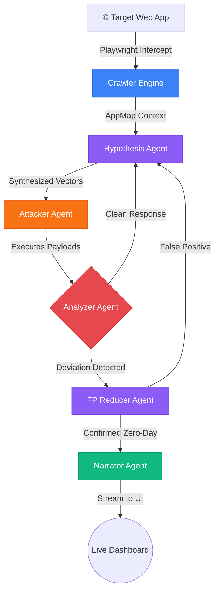

<div align="center">
  
  <h1>The Autonomous AI Security Engineer</h1>
  <p><b>Machine-speed penetration testing. Zero false positives. Enterprise scale.</b></p>
  
  [](#)
  [](#)
  [](#)
  [](#)
</div>

---

## 🚀 The Missing Link in AppSec
Modern CI/CD pipelines deploy code multiple times a day, yet traditional penetration testing takes weeks to schedule and costs tens of thousands of dollars. Automated legacy scanners rely strictly on outdated regex signatures, generating massive walls of "False Positives" that security engineers drown in.

**VEGA fundamentally rewrites this paradigm.** 

By leveraging the bleeding-edge reasoning capabilities of Large Language Models within a cyclical LangGraph agentic loop, VEGA doesn't just "scan" for bugs. It **thinks**. It autonomously crawls complex Single Page Applications, understands business logic, generates stateful attack hypotheses, executes them, and mathematically validates the exploit—all with **zero human intervention**.

---

## 🧠 System Architecture: The Agentic Engine

VEGA’s intelligence is driven by a decentralized swarm of **Five Specialized AI Agents**, executing inside a high-throughput Directed Acyclic Graph (DAG) powered by a robust Python/FastAPI backend and a React (Vite) real-time frontend.



### The Autonomous Pipeline
1. **Crawler Engine**: A headless browser mapping inputs, JWTs, and deep-link API endpoints just like a human navigator.
2. **Hypothesis Agent**: The primary strategist. Analyzes the `AppMap` to predict viable attack surfaces (SQLi, XSS, Broken Access Control) without relying on blind fuzzing.
3. **Attacker Agent**: The executioner. Constructs state-aware HTTP protocols to securely inject logic payloads gracefully.
4. **Analyzer Agent**: The auditor. Runs a strict baseline-diffing algorithm comparing benign HTML responses to post-payload anomalies to detect exact exploit execution.
5. **False Positive Reducer**: The arbiter. A secondary LLM isolates and rejects noise (e.g., standard WAF blocks or random 500s), ensuring 100% signal-to-noise ratio.
6. **Narrator Agent**: The reporter. Generates executive-level markdown reports instantly detailing exact attack chains for remediation.

---

## ⚡ Core Enterprise Capabilities

### 🔹 Granular Batch Scanning & "Max Scan" Sweeps
For expansive enterprise architectures (1,000+ endpoints), VEGA orchestrates **Continuous Dynamic Batching**.
- **Batch Processing**: Slices the infrastructure into manageable parallel runs (default 50 limit blocks) to bypass target API rate limits and minimize LLM token expenditure.
- **Max Scan Override**: A single UI toggle natively overrides batch thresholds. It immediately sweeps the *entirety* of the mapped application network for a explicitly targeted vulnerability (e.g., "Find all SQL injection points right now").

### 🔹 Live Attack Mapping (DAG UI)
Observe your infrastructure being stress-tested in real-time. The React dashboard renders a living Directed Acyclic Graph, explicitly isolating exactly how your endpoints map natively to their confirmed vulnerabilities via transparent **Payload Inject Nodes**. 

---

## 🛠️ Production CI/CD Integration

VEGA is engineered to serve as an immutable security gate inside DevOps pipelines. 

### GitHub Actions Integration Example
Automate "hacker-level" reasoning against your Staging environment before every merge to `main`.

```yaml
name: VEGA Autonomous Pipeline Defense

on:
  pull_request:
    branches: [ "main", "production" ]

jobs:
  security-scan:
    runs-on: ubuntu-latest
    steps:
      - name: Spin Up Staging Service
        run: docker-compose -f docker-compose.staging.yml up -d

      - name: Trigger VEGA Headless AI Suite
        env:
          GROQ_API_KEY: ${{ secrets.GROQ_API_KEY }}
        run: |
          SCAN_ID=$(curl -s -X POST http://vega.cluster.local:8000/scan/start \
            -H "Content-Type: application/json" \
            -d '{"target_url": "http://staging-app:3000", "roles": []}' | jq -r .scan_id)
            
          # Polling execution cycle
          while true; do
            STATUS=$(curl -s http://vega.cluster.local:8000/scan/status | jq -r .phase)
            if [ "$STATUS" == "done" ]; then break; fi
            if [ "$STATUS" == "error" ]; then exit 1; fi
            sleep 10
          done
          
          VULNS_COUNT=$(curl -s http://vega.cluster.local:8000/scan/vulns | jq length)
          
          if [ "$VULNS_COUNT" -gt 0 ]; then
            echo "🚨 Pipeline Blocked: Autonomous Agent detected $VULNS_COUNT novel exploits."
            exit 1
          else
            echo "✅ Validation successful. Infrastructure secure."
            exit 0
          fi
```

## 💻 Local Environment Setup

1. Request your required LLM `GROQ_API_KEY`.
2. Seed your `.env` configuration file inside the root repository:
   ```bash
   GROQ_API_KEY="your_api_key_here"
   ```
3. Use our cross-platform orchestration:
   - **Windows:** Double-click `start.bat`
   - **Unix/macOS:** Run `./start.sh`

The API backbone initializes on `:8000`, hooking immediately into the Dashboard streaming interface on `:5173`. 
